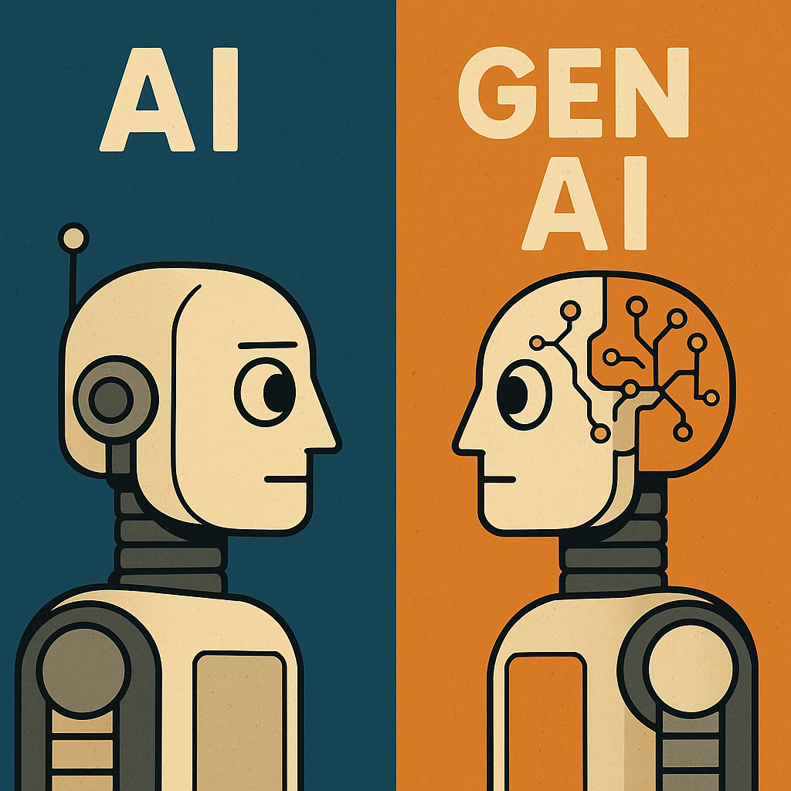
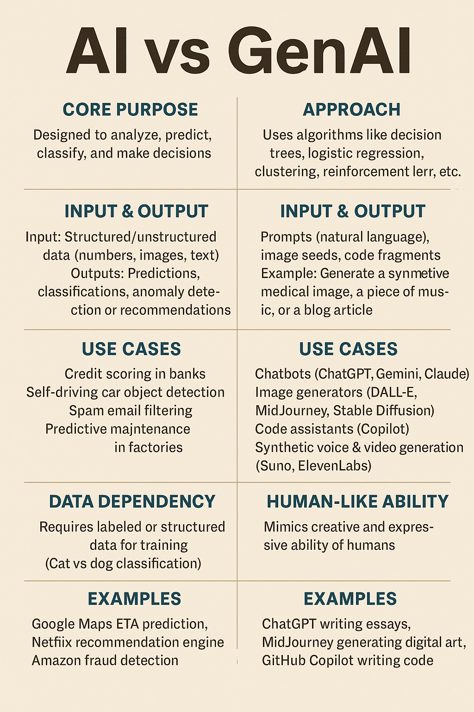

## AI vs GenAI Debate

As an engineering leader working on advanced AI and distributed systems, I’ve witnessed firsthand how confusing the boundaries can be between traditional AI and the emerging wave of Generative AI.

Recently, during our team’s architecture session, we tackled a deceptively simple question: how do we categorize AI and GenAI use cases in our products? The line quickly blurred. Structured tasks like anomaly detection felt solidly AI; anything generating natural language or context seemed more GenAI. Chatbots, code suggestions, and compliance reports sparked debate—are they enhanced AI or truly generative?
In the end, we agreed clear categories are critical for design and scaling decisions. This blog distills our team’s debate, outlining how we differentiate—and sometimes blend—AI and GenAI use cases in modern engineering.

## Traditional AI Use Cases vs Generative AI Use Cases – What Developers Should Know

**Artificial Intelligence (AI)** has coexisted with modern software engineering for well over a decade. From fraud detection to recommendation systems, **AI use cases** have become embedded in nearly every digital product. But with the rise of **Generative AI (Gen AI)**, we’re seeing a shift—where AI doesn’t just analyze or predict, but actually *creates*.  

For developers and architects, the question is often: *When should I use traditional AI and when should I lean on Generative AI?*  

Let’s break this down.

***

## Traditional AI: Predict, Classify, Optimize  
Traditional AI is usually *deterministic within probabilistic bounds*: you feed it structured data, and it predicts, classifies, or optimizes based on patterns it has learned.  

### Common Use Cases
1. **Recommendation Systems (Netflix, Amazon, Spotify)**  
   - Based on user history and behavior, AI models suggest what you might like next.  
   - Techniques: Collaborative Filtering, Matrix Factorization, Gradient Boosted Trees.  

2. **Fraud Detection in Payments**  
   - Classifies transactions as *fraud* vs *legit*.  
   - Uses supervised learning with past transaction data.  

3. **Predictive Maintenance (IoT, Automotive, Aviation)**  
   - Predicts machinery failure before breakdown.  
   - Inputs: sensor logs, temperature, vibration data.  

4. **Search Ranking**  
   - AI ranks results based on relevance and personalization.  
   - Think: Google Search (pre-GenAI era), e-commerce search.  

👉 In all these cases, **AI makes sense when the primary goal is classification, prediction, anomaly detection, or regression based on structured data**.  

***

## Generative AI: Create, Synthesize, Transform  
Generative AI takes things a step further by actually **producing new outputs** — text, images, audio, code — based on learned patterns. Instead of simply predicting *"Will this transaction fail?"*, it can *generate* a human-readable explanation of why it failed.  

### Common Use Cases
1. **Chatbots & Virtual Assistants**  
   - From scripted bots (AI) to conversational agents (GenAI).  
   - Example: Customer support bot that can draft responses, not just select canned answers.  

2. **Content Generation**  
   - Marketing copy, blog outlines, report generation.  
   - Instead of classifying emails as spam/not spam, GenAI can draft a full personalized email.  

3. **Code Generation & Developer Assistants**  
   - GitHub Copilot, TabNine: generate code suggestions, tests, and even entire functions.  

4. **Knowledge Retrieval with Natural Language Interfaces**  
   - Instead of a "search and rank," GenAI enables RAG (Retrieval-Augmented Generation): documents are retrieved + synthesized into an answer.  
   - Think: “summarize all open incidents from last week’s PagerDuty logs.”  

👉 Use **GenAI when the problem requires synthesizing or producing new human-readable (or machine-usable) artifacts**.  

***

## Side-by-Side Comparison  

| Dimension              | Traditional AI Use Case               | Generative AI Use Case |
|-------------------------|----------------------------------------|-------------------------|
| **Primary Task**       | Predict, classify, detect             | Create, generate, summarize |
| **Input Type**         | Structured/tabular, static features   | Natural language, documents, multimedia |
| **Output Type**        | Classes, scores, ranks, labels        | Text, code, images, videos |
| **Example in E-commerce** | Predict whether cart will convert     | Generate personalized product description |
| **Banking Use Case**   | Fraud detection on transactions       | Generate SAR (Suspicious Activity Report) drafts |
| **Developer Example**  | Test case pass/fail prediction        | Auto-generate new regression tests from specs |

***

## Closing Thoughts  
As engineers, we often oversimplify by thinking **“GenAI is replacing AI.”** In reality, GenAI is just another layer — it doesn’t replace predictive or classification AI but rather **extends it into creation and synthesis**.  

The most powerful systems will emerge from **hybrid architectures**, where traditional AI ensures rigor and correctness, while GenAI drives usability and human alignment.  

***

💡 *My advice to developers:* Before bringing in an LLM, ask:  
- Do I just need structured predictions? (→ stick with AI)  
- Or do I need human-like natural interaction and creation? (→ bring in GenAI)  

***
